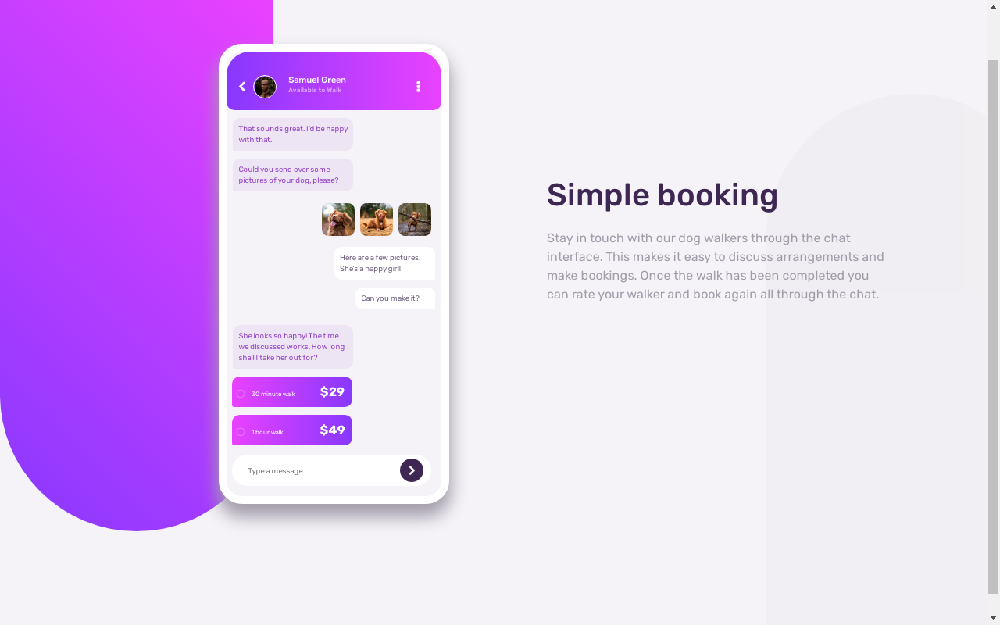

# Frontend Mentor - Chat app CSS Illustration solution

This is a solution to the [Chat app CSS illustration challenge on Frontend Mentor](https://www.frontendmentor.io/challenges/chat-app-css-illustration-O5auMkFqY). Frontend Mentor challenges help you improve your coding skills by building realistic projects. 

## Table of contents

- [Overview](#overview)
  - [The challenge](#the-challenge)
  - [Screenshot](#screenshot)
  - [Links](#links)
- [My process](#my-process)
  - [Built with](#built-with)
  - [What I learned](#what-i-learned)
  - [Continued development](#continued-development)
  - [Useful resources](#useful-resources)
- [Author](#author)
- [Acknowledgments](#acknowledgments)

**Note: Delete this note and update the table of contents based on what sections you keep.**

## Overview

### The challenge

Users should be able to:

- View the optimal layout for the component depending on their device's screen size

### Screenshot

### Links

- Solution URL: [My Frontend Mentor Profile Solutions](https://www.frontendmentor.io/profile/efecollins)
- Live Site URL: [Add live site URL here](https://efecollins.github.io/chat-app)

## My process

### Built with

- Semantic HTML5 markup
- CSS custom properties
- Flexbox
- Sass

### What I learned

I learnt a lot of things while building this or making this project. When doing responsiveness, write your code from desktop to mobile or mobile to desktop(not my thing).

Use your ::after or ::before pseudo-elemnts when you get to where it is of neccessity because at the latter there might be diffulculties.

### Continued development

In future projects, I will like to do more JavaScript.

### Useful resources

- [CodeSTACKr](https://www.codestackr.com) - This helped me for Flexbox and Sass.

## Author

- Website - [Efosa Evbowe](https://efecollins.github.io/new-pweb/dist)
- Frontend Mentor - [@efecollins](https://www.frontendmentor.io/profile/efecollins)
- Twitter - [@EfeCollins7](https://www.twitter.com/EfeCollins7)

## Acknowledgments

I thank Arty Simon for using his chat app css illustration as a guide including his JavaScript code. Thanks.
